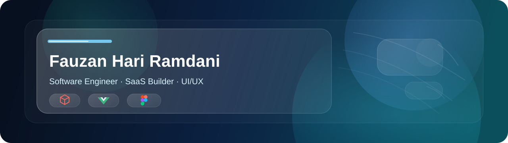

# 

<!-- <h1 align="center">Fauzan Hari Ramdani</h1> -->

  <!-- <strong>Rza</strong>  -->
  ☕ Coding Enthusiast | 🎨 UI/UX 

  <a href="p">Portfolio</a>
  ·
  <a href="p">LinkedIn</a>
  ·
  <a href="p">TikTok</a>
  ·
  <a href="contact me to:fauzanhari4@gmail.com">Email</a>

## Tech Stack

  
  
  
  
  
  
  
  
  
  
  
  
  

## Currently Building

Full stack applications, and internal tools with a focus on reliability and practical value.

## GitHub Statistics

  

  

  

  <picture>
    <source media="(prefers-color-scheme: dark)" srcset="https://raw.githubusercontent.com/fauzanhari/fauzanhari/output/puzzle-bobble-contribution-graph-dark.svg" />
    <source media="(prefers-color-scheme: light)" srcset="https://raw.githubusercontent.com/fauzanhari/fauzanhari/output/puzzle-bobble-contribution-graph.svg" />
    
  </picture>

